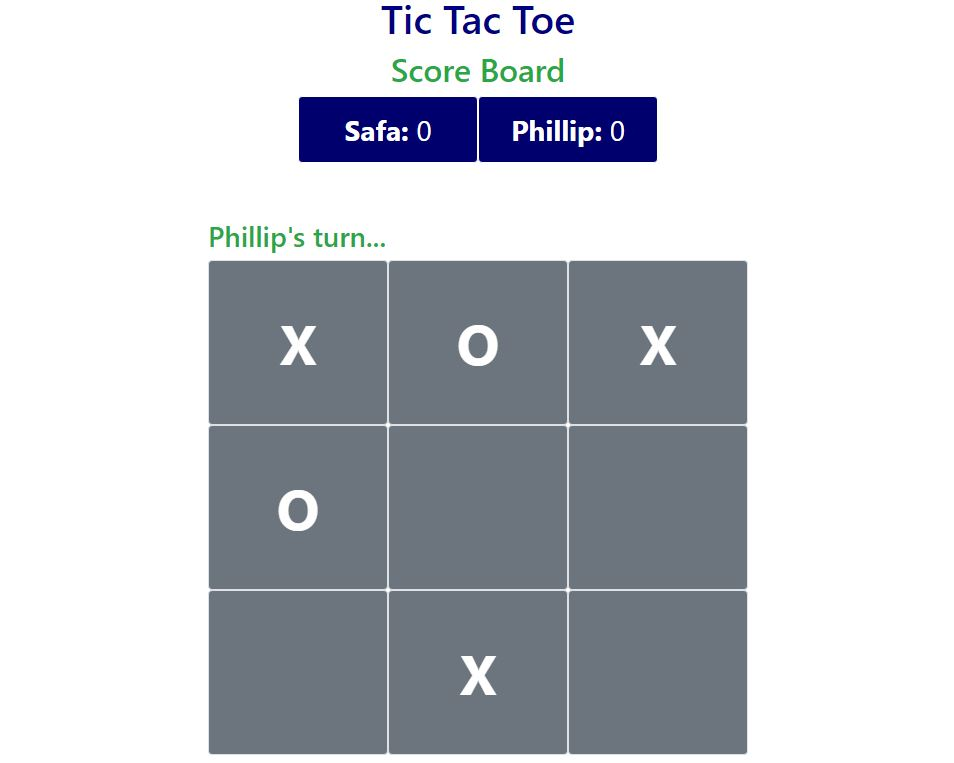

<h3 align="center">Java Script- TicTacToe Project</h3>

---

   

## About 

<h3 align="center"> In this project, we built a Tic Tac Toe game. The main goal is to put into practice the main concepts of Factory functions and Modules.</h3>

- If you want to play it online visit [this link](https://rawcdn.githack.com/SafaErden/TicTacToe-Javascript/1684e65107f30bc98486f3d0a39f02a4d4cd09cc/index.html) to reach and play our tic tac toe game online.

## How to start the game?

- download this repository

- unpack it (winrar recommended)

- copy its address e.g.: c:\users\you\downloads\tictactoe

- open your terminal commandline (powershell in my case)

- write "cd" and put the address of the game folder

- now, to run the game, open the index file with Live Server

- Have fun!

## Rules

You probably already know how to play Tic-Tac-Toe. It's a really simple game, right? That's what most people think. But if you really wrap your brain around it, you'll discover that Tic-Tac-Toe isn't quite as simple as you think!

Tic-Tac -Toe (along with a lot of other games) involves looking ahead and trying to figure out what the person playing against you might do next.

## RULES FOR TIC-TAC-TOE

1. The game is played on a grid that's 3 squares by 3 squares.

2. If you are X, your friend is O, or vice versa. Players take turns putting their marks in empty squares.

3. The first player to get 3 of her marks in a row (up, down, across, or diagonally) is the winner.

4. When all 9 squares are full, the game is over. If no player has 3 marks in a row, the game ends in a tie.

## HOW CAN I WIN AT TIC-TAC-TOE?

- To beat the other, you need to make use of a little bit of strategy. Strategy means figuring out what you need to do to win.

- Part of your strategy is trying to figure out how to get three Xs or Os in a row. The other part is trying to figure out how to stop the other player from getting three Os or Xs in a row.

- After you put a sign in a square, you start looking ahead. Where's the best place for your next move? You look at the empty squares and decide which ones are good choices—which ones might let you make three Xs or Os in a row.

- You also have to watch where the other player puts its move. That could change what you do next. If the component gets two Os or Xs in a row, you have to put your next move in the last empty square in that row, or the component will win. You are forced to play in a particular square or lose the game.

If you always pay attention and look ahead, you'll never lose a game of Tic-Tac-Toe. You may not win, but at least you'll tie.
<a href="https://www.exploratorium.edu/brain_explorer/tictactoe.html">Source</a>

---

## 🔧 Built with

- HTML
- JavaScript
- CSS/Bootstrap

## ✒️ Autors 

👤 **Safa ERDEN**

- Github: [@SafaErden](https://github.com/SafaErden)
- Twitter: [@safaerden](https://twitter.com/safaerden)
- Linkedin: [@safaerden](https://www.linkedin.com/in/safaerden/)

👤 **Phillip Musiime**

- Github: [@phillipmusiime](https://github.com/PhillipUg)
- Twitter: [@phillipmusiime](https://twitter.com/Phillip_Ug)
- Linkedin: [@phillipmusiime](https://www.linkedin.com/in/phillip-musiime/)

## 🤝 Contributing

Contributions, issues and feature requests are welcome!

Feel free to check the [issues page](https://github.com/SafaErden/TicTacToe-Javascript/issues).

## 👍 Show your support

Give a ⭐️ if you like this project!

## 📝 License

This project is free to use as learning purposes. For any external content (e.g. logo, images, ...), please contact the proper author and check their license of use.
